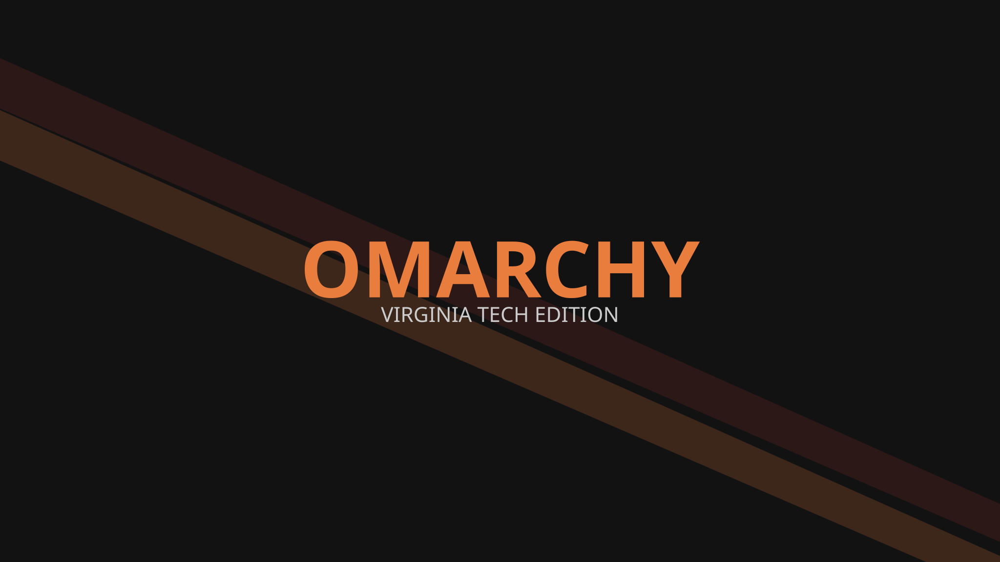

# Omarchy Virginia Tech Theme

A bold, high-contrast dark theme for [Omarchy](https://omarchy.org) inspired by the colors of Virginia Tech: maroon and orange.



## Install

```bash
omarchy theme install https://github.com/user/omarchy-virginia-tech
```

## Palette

| Role | Hex |
| --- | --- |
| Background | `#121212` |
| Foreground | `#e0e0e0` |
| Accent | `#E87D3E` |
| Selection | `#632523` |
| Muted | `#424242` |

Full ANSI palette in [`colors.toml`](colors.toml). Icons are defined in `icons.theme`.
